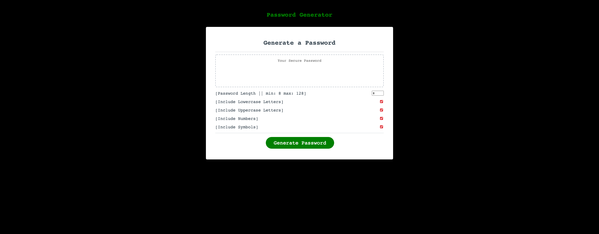
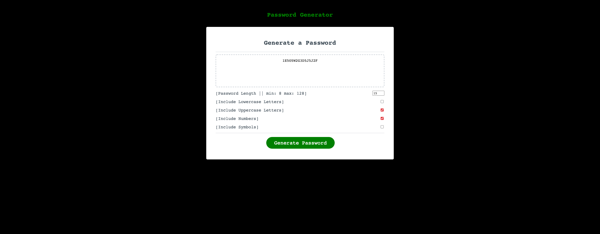

# [passwordAutoGenerator]
H!!! this is my automated password generator program supported by Javascript :call_me_hand: 


Here is what the program looks like when you open the webpage



As you can see I went with my consistent Hackery vibe with this program like i did with my portfolio :mechanical_arm:

## How to Use 
So you must clone this repository as a zip or directly through terminal 

Once you have downloaded the project then direct it where you stored the file and run:

```
code ..

```

or you can just use the deployment link:[Link text here](https://jamestpatmore.github.io/passwordAutoGenerator/)

## Functionality 

So this password generator has an intresting algorithim :rocket:
You have the ability of choosing bewtween eight and one hundred twenty eight charcters for your password :bangbang:
And if you want your password to only have certain characteristics (uppercase,lowercase,numbers,symbols)
You can use the checkbox functions to fulfill yourt wnats/needs :ballot_box_with_check:



## Credits 
Now there was some tough concepts with this project, I did originally make an algorithim that worked but I couldn't figure out 
how to assdign the checkbox functions for the algorithim, so I grabbed some inspiration from Traversy Media (Link below):

[Link text here](https://www.youtube.com/watch?v=duNmhKgtcsI)